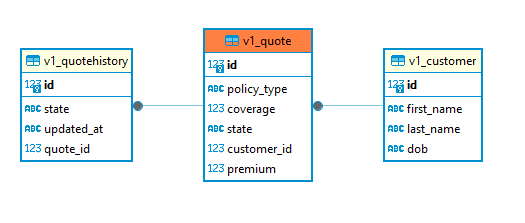
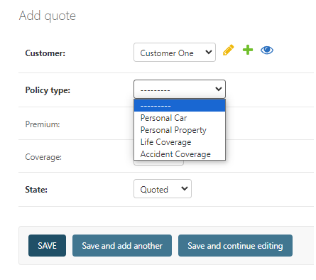
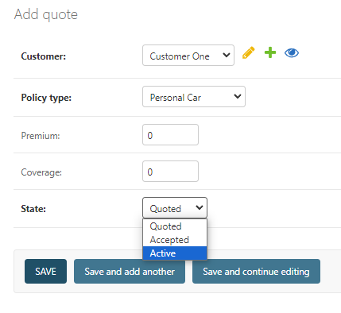
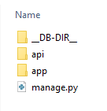
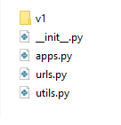
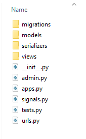
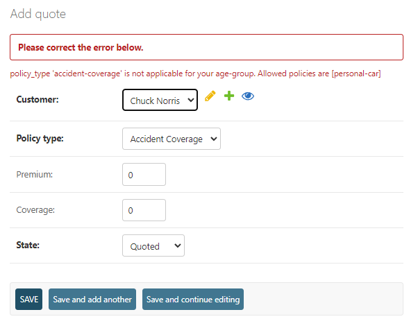

# Democrance - Task (Implementation Overview)
This document created to give an overview of the task implementation, ERD, assumptions and directory structure. It aims to facilitating the reviewer.

## Entity Relationship
For this task, three entities are created, as can be seen in following image.

For policies, [in-code datastructure](insurance_system/api/utils.py#L43)  is used. It has been kept in mind that even though policies are not persisted in DB, on Admin Panel all required fields are available for ease of use.

> [!NOTE]  
> Please note that quotehistory table will not be visible in AdminPanel but its data can be accesses through policies endpoints

## Directory Structure
Code is comprised of two applications

- **app:** This is the entry point of the system. It contains following
  - Admin account migration
  - Custom exception handler
  - Main api-endpoints

- **api:** This is the actual implementation of the system. As deduced from assessment criteria images, setup has been kept flexible so as to facilitate upgradation and maintainance of apis. It contains following

   - urls
   - utils
   - v1

- **api.v1**: This directory contains Customer, Quote, Policy and Search components. Code has been divided on the basis of types.e.g., models, serializers and views are in their respective directories

## Validations
All APIs have been developed with some validations. Major validations for testing are listed here
- String validation follows this [regex section](insurance_system/api/utils.py#L21). Rules are as follows
  - First two characters must be alphabets
  - Numbers are not allowed
  - Name cannot end with special symbol
  - Two consective special characters cannot come together
  - Customer full name must be unique

- Birthday validations are as follows
  - Birthday cannot be in-future
  - Person cannot be more than 100 years old

- Policy follows these rules
  - One customer cannot have one policy more than once
  - Policy eligibility is determined by the age group
  - If quote creation fails, system indicate what are the allowed policy-types which current customer is eligible for.
  

- Authentication
All api-endpoints are open access to all. No authentication scheme has been incorporated at api-endpoints

## Additional Considerations
> [!TIP]
> Initial testing is suggested to be done via SwaggerUI.

> [!WARNING]  
> SuperUser account `admin` with password `admin123` is created via migrations. Do not create admin account via django-admin

In-case of any ambiguity, feel-free to reach out to me, I would love to hear about the review, feedback and suggestions.