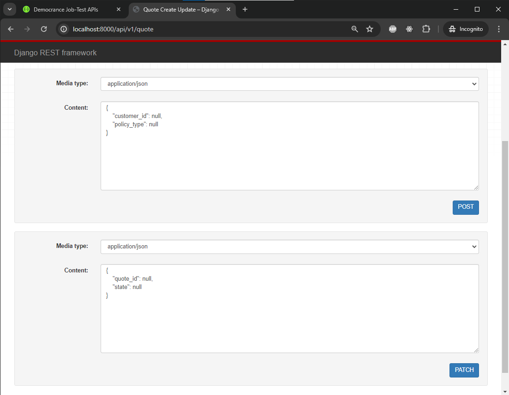

# Democrance - Task
This repo is created to demonstrate task execution and completion as part of hiring process.


## Task Details
This task comprised of 4 Steps.
- Customer creation and verification.
- Quote/Policy generation and listing.
- Search implementation based on name, year and policy
- Authentication mechanism discussion

## Task Verification
Task is complete and can be tested as follows.

#### Clone repository
```
git clone https://github.com/tabahi84/dctask-tahirbashir
```

#### Setup
- Set cloned directory as working directrory
```
cd cd dctask-tahirbashir
```
- conda - setup
```
conda create -n envDCTask python=3.10
conda activate envDCTask
pip install -r requirements.txt
```
- Run Code
```
python manage.py migrate
python manage.py runserver
```

### Testing
Once code is running, DJango application will be available on [localhost:8000](http://localhost:8000)

- AdminPanel

URL: http://localhost:8000/admin
```
username: admin
password: admin123
```


- SwaggerUI (**Preferable**)

URL: http://localhost:8000/docs


- DJango Views

URL: http://localhost:8000/api/v1/create_customer


URL: http://localhost:8000/api/v1/quote


## Testing

All workflows mentioned in task are tested and are ready for review.


